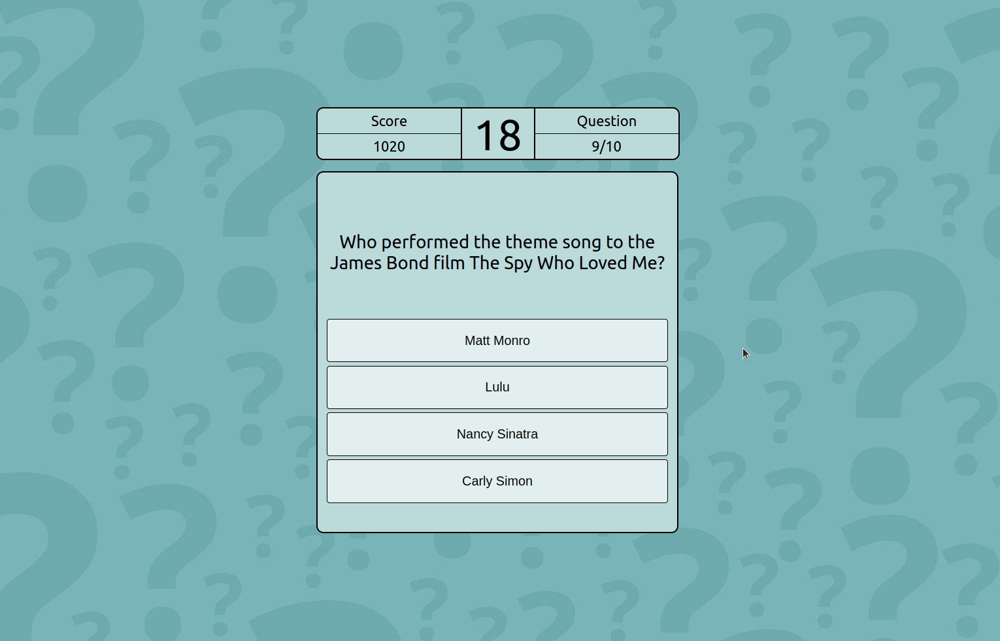

## Quick Trivia

Feeling smart? Test yourself with some Quick Trivia by checking it out on [Netlify!](https://quick-trivia-game.netlify.app/)

This app was created using React with the intention of improving my skills with the library. Some new skills I've gained from working on this project includes an introduction to:
- MongoDB (To store leaderboard data)
- Netlify (Hosts my front-end)
- Heroku (Hosts my back-end)
- React Context

A user can select the category they want to test themselves in, and 10 questions will be randomly selected using a trivia [API](https://rapidapi.com/willrfry/api/trivia8/). When a user begins their game, a timer starts, and if they answer correctly, their score will increase based on how quick the user answered the question.

I have most recently added a leaderboard to my game, with the front-end being hosted on Netlify and the back-end hosted on Heroku.

Enjoy, and good luck!

### The App

#### Game Beginning

#### Game End

#### Submitting Score

