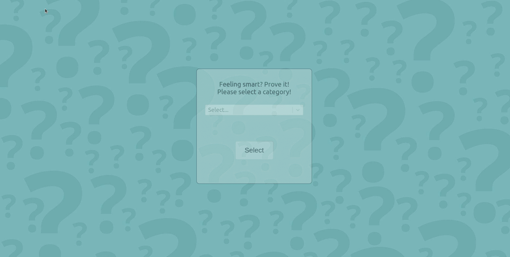
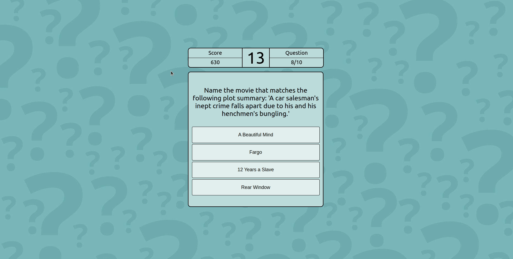

## Quick Trivia

### *APP CURRENTLY DOWN WHILE SERVER IS BEING CREATED*

Feeling smart? Test yourself with some Quick Trivia! Check it out on [Heroku!](https://trivia-react-game.herokuapp.com/)

This app was created using React with the intention of improving my skills with the library. 

A user can select the category they want to test themselves in, and 10 questions will be randomly selected using a trivia [API](https://rapidapi.com/willrfry/api/trivia8/). When a user begins their game, a timer starts, and if they answer correctly, their score will increase based on how quick the user answered the question.

This app is still a work-in-progress with plans to setup a back-end and create a leaderboard, and was most recently made mobile-friendly.

Enjoy, and good luck!

### The App

#### Game Beginning

#### Game End

